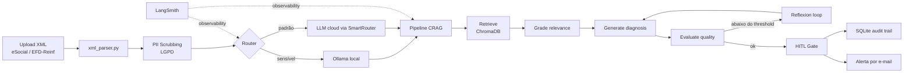
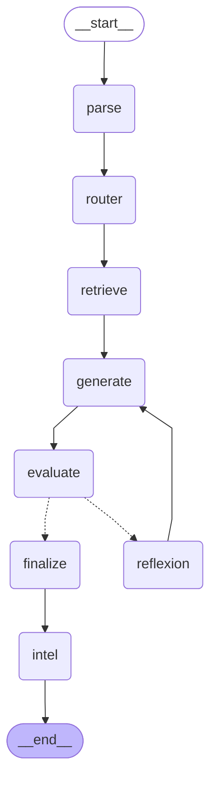

# ⚙️ EII — ERP Incident Intelligence

> Agentic AIOps para incidentes de compliance em HCM/ERP — diagnóstico de rejeições eSocial e EFD-Reinf com CRAG, Deep Agents e Human-in-the-Loop.

[](https://github.com/edson-aiops/eii-erp-incident-intelligence)
[](https://www.python.org/)
[](https://langchain-ai.github.io/langgraph/)
[](https://www.gradio.app/)
[](https://www.docker.com/)
[](LICENSE)
[](https://huggingface.co/spaces/EdsonPO/eii-erp-incident-intelligence)
[](README_EN.md)

<!-- TODO: adicionar demo.gif -->
<!--  -->

---

## 🤖 O que é o EII?

Respostas de rejeição do governo para eventos eSocial e EFD-Reinf chegam como XMLs com códigos de erro pouco claros. Diagnosticar a causa raiz exige conhecimento especializado em legislação trabalhista, regras fiscais e leiautes de integração HCM/ERP — trabalho que normalmente recai sobre analistas sêniores e gera gargalos no fechamento da folha.

O **EII** é um sistema de diagnóstico agêntico que lê o XML de rejeição, recupera conhecimento relevante por meio de um pipeline **Corrective RAG (CRAG)** e propõe um diagnóstico estruturado com passos de resolução. Todo diagnóstico para em um **Human-in-the-Loop (HITL)** antes de qualquer ação ser registrada, tornando o sistema seguro por design para fluxos críticos de compliance.

---

## 🏛️ Arquitetura

### Fluxo ponta-a-ponta



### Workflow Deep Agents LangGraph

O pipeline em `src/deep_agents/` é implementado como um `StateGraph` compilado do LangGraph com 8 nós:


<details>
<summary>Ver fonte Mermaid</summary>



</details>

**CRAG → HITL explicado:** o parser extrai evento, código de erro e ocorrências; o router decide o backend de LLM; o nó retrieve busca na base vetorial; o generate produz o diagnóstico estruturado; o evaluate pontua a qualidade e dispara o loop de reflexion se necessário; o finalize formata a resposta; e o intel adiciona análise proativa de padrões. A saída final vai para a aba HITL, onde o analista aprova ou rejeita.

---

## ✨ Funcionalidades

| Funcionalidade | Descrição |
| --- | --- |
| **Deep Agents LangGraph** | Workflow agêntico de 8 nós (`parse → router → retrieve → generate → evaluate → reflexion → finalize → intel`) compilado com `StateGraph`. |
| **Pipeline CRAG** | Retrieve → Grade → Generate → Evaluate → Reflexion, com confidence score baseado em logprobs e fallback quando nenhum documento da KB é relevante. |
| **HITL Gate** | Todo diagnóstico é registrado como `PENDING` e exige aprovação/rejeição explícita do analista com notas. |
| **Audit Trail** | Persistência SQLite com decisões imutáveis (`APPROVED` / `REJECTED` / `PENDING`) e hash de metadados. |
| **SmartRouter Multi-LLM** | 9 provedores configurados — Groq, Anthropic, Mistral, Cerebras, Google AI, Ollama; Kimi/Qwen/DeepSeek roteados via Groq. |
| **MCP Server** | `mcp_server.py` expõe `eii_query(xml)` e `eii_escalate(incident_id, status, notes)` via fastmcp para qualquer cliente MCP. |
| **REST API** | Serviço FastAPI (`api.py`) com 6 endpoints e autenticação `X-API-Key`. |
| **LGPD by Design** | Scrubbing de CPF, CNPJ, NIS/PIS e nomes de trabalhadores **antes** de qualquer chamada ao LLM; inferência local opcional via Ollama. |
| **Parser XML Unificado** | Auto-detecta eSocial vs EFD-Reinf e suporta 20 eventos EFD-Reinf (`R-1000`, `R-2010`–`R-2099`, `R-4010`–`R-4099`, `R-9000`–`R-9015`). |
| **IntelAgent** | Análise proativa pós-diagnóstico que identifica padrões recorrentes nos incidentes recentes sem chamadas extras de LLM. |
| **Batch Processor** | Análise paralela de múltiplos XMLs via `ThreadPoolExecutor`. |
| **Observabilidade** | Tracing opcional via LangSmith com metadata estruturada por nó; no-op quando não configurado. |

---

## 🚀 Quick Start

### 1. Clone e instale

```bash
git clone https://github.com/edson-aiops/eii-erp-incident-intelligence.git
cd eii-erp-incident-intelligence
pip install -r requirements.txt
```

### 2. Configure os secrets

**Opção A — Windows Credential Manager (recomendado para uso local):**

```powershell
python -c "import keyring; keyring.set_password('EII_Project', 'GROQ_API_KEY', 'gsk_...')"
python -c "import keyring; keyring.set_password('EII_Project', 'EII_ADMIN_USER', 'your-username')"
python -c "import keyring; keyring.set_password('EII_Project', 'EII_ADMIN_PASS', 'sua-senha-segura')"
```

**Opção B — arquivo `.env`:**

```bash
cp .env.example .env
# edite .env com suas chaves
```

### 3. Rode o app local

```bash
python app.py
# acesse http://127.0.0.1:7860
```

### 4. Rode a REST API (em outro terminal)

```bash
uvicorn api:app --host 0.0.0.0 --port 8000 --reload
# docs em http://localhost:8000/docs
```

### 5. Rode os testes

```bash
python -m pytest tests/ -v --tb=short
```

### 6. Docker (opcional)

```bash
docker build -t eii .
docker run -p 7860:7860 --env-file .env eii
```

---

## 🎭 Modo Dual: Local vs Público

O EII entrega dois entry points por design:

| Versão | Arquivo | Público | Auth | Dados | Backend LLM |
| --- | --- | --- | --- | --- | --- |
| **Local** | `app.py` | Operação interna | Login SHA-256 + keyring | Dados reais permitidos | SmartRouter + Ollama |
| **Pública** | `app_hf.py` | Recrutadores / demo | Nenhum | Sem dados reais | Apenas Groq cloud |

A versão pública é propositalmente minimalista e roda no HuggingFace Spaces. A versão local concentra autenticação, audit trail e inferência local LGPD-aware. **A demo pública nunca recebe dados de produção** — essa é uma arquitetura de privacidade deliberada, não uma limitação.

---

## 📁 Estrutura do Projeto

```
eii-erp-incident-intelligence/
├── app.py                          # App Gradio local (auth + SmartRouter + HITL)
├── app_hf.py                       # Demo pública do HuggingFace Space
├── api.py                          # REST API FastAPI
├── crag_pipeline.py                # Pipeline CRAG (base)
├── crag_pipeline_smartrouter.py    # Pipeline CRAG + wrapper SmartRouter
├── knowledge_base.py               # 93 incidentes curados (eSocial + EFD-Reinf)
├── xml_parser.py                   # Parser unificado eSocial/EFD-Reinf + PII scrubber
├── notifier.py                     # Alertas por e-mail do HITL
├── observability.py                # Shim de tracing LangSmith
├── mcp_server.py                   # Servidor MCP (eii_query / eii_escalate)
├── eii_handlers.py                 # Handlers puros Python para reuso MCP/API
├── batch_processor.py              # Processamento paralelo de XMLs
├── secure_secrets.py               # Helper do Windows Credential Manager
├── smartrouter/                    # Roteador multi-LLM
├── src/deep_agents/                # Workflow agêntico LangGraph de 8 nós
├── src/intel_agent/                # Análise proativa pós-diagnóstico
├── tests/                          # Suite de testes
├── assets/                         # Diagramas e mídia de demo
├── docs/                           # Documentos de arquitetura
├── STATUS.md                       # Estado atual e roadmap
├── CHANGELOG.md                    # Histórico de versões
├── DUAL_MODE.md                    # Arquitetura local vs pública
├── AGENTS.md                       # Protocolo de colaboração multi-agente
└── LICENSE                         # Licença MIT
```

---

## 🛠️ Stack Técnico

| Camada | Tecnologia | Propósito |
| --- | --- | --- |
| Linguagem | Python 3.11+ | Baseline de runtime (Dockerfile) |
| UI | Gradio ≥5.0 | Interface web local e pública |
| Orquestração de agentes | LangGraph ≥0.2 | Workflow Deep Agents |
| Retrieval | ChromaDB ≥0.6 (in-memory), Qdrant opcional | Base vetorial de conhecimento |
| Embeddings | sentence-transformers 3.1.1 | `all-MiniLM-L6-v2` (384-dim) |
| Roteamento LLM | SmartRouter | 9 provedores com fallback por tarefa |
| REST API | FastAPI ≥0.111, uvicorn ≥0.29 | Integração ERP/HCM |
| MCP | fastmcp ≥3.0 | Servidor Model Context Protocol |
| Persistência | SQLite | Audit trail, decisões HITL, IntelAgent |
| Observabilidade | LangSmith ≥0.1 | Tracing opcional |
| Secrets | keyring ≥25.0 | Windows Credential Manager |
| Container | Docker | Deploy reprodutível no HuggingFace Spaces |

---

## 🔒 Observabilidade e Privacidade

**Tracing LangSmith:** quando `LANGSMITH_API_KEY` está configurada, cada execução do pipeline gera um trace estruturado com metadata por nó (tipo de evento, código de erro, decisão de roteamento, confiança, referências KB). Quando não configurada, `observability.traceable` é um no-op sem overhead.

**LGPD privacy by design:** `xml_parser.scrub_pii()` mascara CPF, CNPJ, NIS/PIS e nomes de trabalhadores antes de qualquer prompt ser construído ou persistido. Para payloads ultra-sensíveis, o analista pode habilitar inferência local via Ollama, mantendo os dados fora de APIs de terceiros.

---

## 📈 Roadmap

### Concluído

- ✅ **Fase 1 — Foundation (v1.0):** UI Gradio, pipeline CRAG base, parser eSocial
- ✅ **Fase 2 — Intelligence & Compliance (v2.0):** PII scrubbing, audit SQLite, confidence por logprobs, suite de testes
- ✅ **Fase 3 — Production (v2.2):** SmartRouter, MCP server, auth local, batch processor, modo mentor
- ✅ **Fase 4 — Deep Agents (v2.3):** Pipeline LangGraph de 8 nós, IntelAgent, REST API, painel admin
- ✅ **Fase 5 — Observability & Scale (v3.1):** Traces LangSmith, parser EFD-Reinf, KB expandida para 93 incidentes, notifier de e-mail

### Planejado

- ⏳ **Fase 6 — SaaS & Integrações (v4.0):** multitenancy, roteamento EFD-Reinf completo no deep agents, demo pública refinada

> *A Fase 6 depende de um piloto real com uma segunda organização.*

---

## 👤 Autor

**Edson Oliveira** — Senior IT Systems Analyst em transição para AI Agentic Engineering

[](https://github.com/edson-aiops)
[](https://huggingface.co/EdsonPO)
[](https://www.linkedin.com/in/edson-pereira-oliveira)

12+ anos em HCM, folha de pagamento e ERP corporativo.
Projeto de portfólio aplicado a perfis de Business Systems / Information Systems Analyst.

---

## 📄 Licença

[MIT License](LICENSE) — uso, modificação e redistribuição livres com atribuição.

---

**Última atualização:** julho/2026 · v3.1
