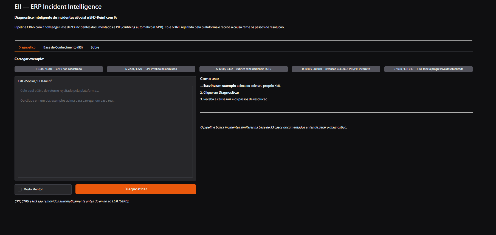
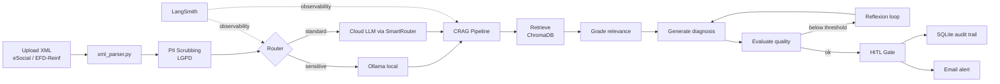
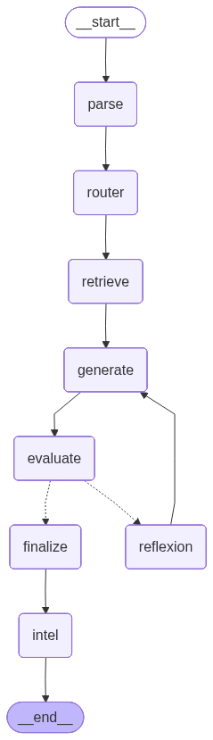
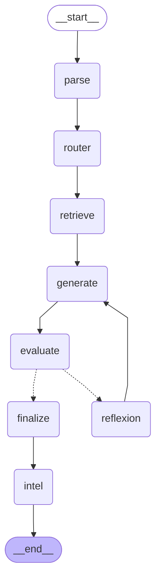

# EII — ERP Incident Intelligence

> Agentic AIOps for HCM/ERP compliance incidents — eSocial & EFD-Reinf diagnostics with CRAG, Deep Agents and Human-in-the-Loop.

[](https://github.com/edson-aiops/eii-erp-incident-intelligence)
[](https://www.python.org/)
[](https://langchain-ai.github.io/langgraph/)
[](https://www.gradio.app/)
[](https://www.docker.com/)
[](LICENSE)
[](https://huggingface.co/spaces/EdsonPO/eii-erp-incident-intelligence)
[](README.md)

<!-- TODO: adicionar demo.gif -->
<!--  -->

---

## 🤖 What is EII?

Government rejection responses for eSocial and EFD-Reinf events arrive as XML payloads packed with cryptic error codes. Diagnosing the root cause demands specialized knowledge of Brazilian labor laws, tax rules and HCM/ERP integration layouts — work that usually falls on senior analysts and creates bottlenecks during payroll closing.

**EII** is an agentic diagnostic system that reads the rejection XML, retrieves relevant knowledge through a Corrective RAG (CRAG) pipeline, and proposes a structured diagnosis with resolution steps. Every diagnosis stops at a **Human-in-the-Loop (HITL)** gate before any action is recorded, making the system safe by design for compliance-critical workflows.

---

## 🏛️ Architecture

### End-to-end flow



### LangGraph Deep Agents workflow

The `src/deep_agents/` pipeline is implemented as a compiled LangGraph `StateGraph` with 8 nodes:



<details>
<summary>View Mermaid source</summary>



</details>

**CRAG → HITL explained:** the parser extracts event, error code and occurrences; the router decides the LLM backend; the retrieve node searches the vector knowledge base; the generate node produces a structured diagnosis; the evaluate node scores quality and triggers a reflexion loop if the score is too low; finalize formats the answer; and the intel node adds proactive pattern analysis. The final output lands in the HITL tab for analyst approval.

---

## ✨ Features

| Feature | Description |
| --- | --- |
| **Deep Agents LangGraph** | 8-node agentic workflow (`parse → router → retrieve → generate → evaluate → reflexion → finalize → intel`) compiled with `StateGraph`. |
| **CRAG Pipeline** | Retrieve → Grade → Generate → Evaluate → Reflexion, with logprobs-based confidence scoring and fallback when no KB doc is relevant. |
| **HITL Gate** | Every diagnosis is recorded as `PENDING` and requires explicit analyst approval/rejection with notes. |
| **Audit Trail** | SQLite persistence with immutable decisions (`APPROVED` / `REJECTED` / `PENDING`) and metadata hash. |
| **SmartRouter Multi-LLM** | 9 providers configured — Groq, Anthropic, Mistral, Cerebras, Google AI, Ollama; Kimi/Qwen/DeepSeek routed via Groq. |
| **MCP Server** | `mcp_server.py` exposes `eii_query(xml)` and `eii_escalate(incident_id, status, notes)` via fastmcp for any MCP client. |
| **REST API** | FastAPI service (`api.py`) with 6 endpoints and `X-API-Key` authentication. |
| **LGPD by Design** | PII scrubbing of CPF, CNPJ, NIS/PIS and worker names **before** any LLM call; optional local inference via Ollama. |
| **Unified XML Parser** | Auto-detects eSocial vs EFD-Reinf and supports 20 EFD-Reinf events (`R-1000`, `R-2010`–`R-2099`, `R-4010`–`R-4099`, `R-9000`–`R-9015`). |
| **IntelAgent** | Proactive post-diagnosis analysis that surfaces recurrence patterns from recent incidents without extra LLM calls. |
| **Batch Processor** | Parallel analysis of multiple XML files via `ThreadPoolExecutor`. |
| **Observability** | Optional LangSmith tracing with structured metadata per node; no-op when not configured. |

---

## 🚀 Quick Start

### 1. Clone and install

```bash
git clone https://github.com/edson-aiops/eii-erp-incident-intelligence.git
cd eii-erp-incident-intelligence
pip install -r requirements.txt
```

### 2. Configure secrets

**Option A — Windows Credential Manager (recommended for local use):**

```powershell
python -c "import keyring; keyring.set_password('EII_Project', 'GROQ_API_KEY', 'gsk_...')"
python -c "import keyring; keyring.set_password('EII_Project', 'EII_ADMIN_USER', 'your-username')"
python -c "import keyring; keyring.set_password('EII_Project', 'EII_ADMIN_PASS', 'sua-senha-segura')"
```

**Option B — `.env` file:**

```bash
cp .env.example .env
# edit .env with your keys
```

### 3. Run the local app

```bash
python app.py
# open http://127.0.0.1:7860
```

### 4. Run the REST API (separate terminal)

```bash
uvicorn api:app --host 0.0.0.0 --port 8000 --reload
# docs at http://localhost:8000/docs
```

### 5. Run tests

```bash
python -m pytest tests/ -v --tb=short
```

### 6. Docker (optional)

```bash
docker build -t eii .
docker run -p 7860:7860 --env-file .env eii
```

---

## 🎭 Dual Mode: Local vs Public

EII ships two entry points by design:

| Version | File | Audience | Auth | Data | LLM backend |
| --- | --- | --- | --- | --- | --- |
| **Local** | `app.py` | Internal operation | SHA-256 login + keyring | Real data allowed | SmartRouter + Ollama |
| **Public** | `app_hf.py` | Recruiters / demo | None | No real data | Groq cloud only |

The public version is intentionally minimal and runs on HuggingFace Spaces. The local version holds authentication, audit trail and LGPD-aware local inference. **The public demo never receives production data** — this is a deliberate privacy architecture, not a limitation.

---

## 📁 Project Structure

```
eii-erp-incident-intelligence/
├── app.py                          # Local Gradio app (auth + SmartRouter + HITL)
├── app_hf.py                       # Public HuggingFace Space demo
├── api.py                          # FastAPI REST API
├── crag_pipeline.py                # CRAG pipeline (base)
├── crag_pipeline_smartrouter.py    # CRAG pipeline + SmartRouter wrapper
├── knowledge_base.py               # 93 curated incidents (eSocial + EFD-Reinf)
├── xml_parser.py                   # Unified eSocial / EFD-Reinf parser + PII scrubber
├── notifier.py                     # HITL email alerts
├── observability.py                # LangSmith tracing shim
├── mcp_server.py                   # MCP server (eii_query / eii_escalate)
├── eii_handlers.py                 # Pure Python handlers for MCP/API reuse
├── batch_processor.py              # Parallel XML batch processing
├── secure_secrets.py               # Windows Credential Manager helper
├── smartrouter/                    # Multi-LLM router
├── src/deep_agents/                # LangGraph 8-node agent workflow
├── src/intel_agent/                # Proactive post-diagnosis analysis
├── tests/                          # Test suite
├── assets/                         # Diagrams and demo media
├── docs/                           # Architecture docs
├── STATUS.md                       # Current state and roadmap
├── CHANGELOG.md                    # Version history
├── DUAL_MODE.md                    # Local vs public architecture
├── AGENTS.md                       # Multi-agent collaboration protocol
└── LICENSE                         # MIT License
```

---

## 🛠️ Tech Stack

| Layer | Technology | Purpose |
| --- | --- | --- |
| Language | Python 3.11+ | Runtime baseline (Dockerfile) |
| UI | Gradio ≥5.0 | Local and public web interface |
| Agent orchestration | LangGraph ≥0.2 | Deep Agents workflow |
| Retrieval | ChromaDB ≥0.6 (in-memory), Qdrant optional | Vector knowledge base |
| Embeddings | sentence-transformers 3.1.1 | `all-MiniLM-L6-v2` (384-dim) |
| LLM routing | SmartRouter | 9 providers with task-based fallback |
| REST API | FastAPI ≥0.111, uvicorn ≥0.29 | ERP/HCM integration |
| MCP | fastmcp ≥3.0 | Model Context Protocol server |
| Persistence | SQLite | Audit trail, HITL decisions, IntelAgent |
| Observability | LangSmith ≥0.1 | Optional tracing |
| Secrets | keyring ≥25.0 | Windows Credential Manager |
| Container | Docker | Reproducible deploy to HuggingFace Spaces |

---

## 🔒 Observability & Privacy

**LangSmith tracing:** when `LANGSMITH_API_KEY` is set, each pipeline run produces a structured trace with node-level metadata (event type, error code, routing decision, confidence, KB references). When unset, `observability.traceable` is a zero-overhead no-op.

**LGPD privacy by design:** `xml_parser.scrub_pii()` masks CPF, CNPJ, NIS/PIS and worker names before any prompt is built or persisted. For ultra-sensitive payloads the analyst can enable local inference via Ollama, keeping data off third-party APIs.

---

## 📈 Roadmap

### Completed

- ✅ **Phase 1 — Foundation (v1.0):** Gradio UI, base CRAG pipeline, eSocial parser
- ✅ **Phase 2 — Intelligence & Compliance (v2.0):** PII scrubbing, SQLite audit, logprobs confidence, test suite
- ✅ **Phase 3 — Production (v2.2):** SmartRouter, MCP server, local auth, batch processor, mentor mode
- ✅ **Phase 4 — Deep Agents (v2.3):** LangGraph 8-node pipeline, IntelAgent, REST API, admin panel
- ✅ **Phase 5 — Observability & Scale (v3.1):** LangSmith traces, EFD-Reinf parser, KB expanded to 93 incidents, email notifier

### Planned

- ⏳ **Phase 6 — SaaS & Integrations (v4.0):** multitenancy, full EFD-Reinf deep-agent routing, refined public demo

> *Phase 6 is gated on a real pilot with a second organization.*

---

## 👤 Author

**Edson Oliveira** — Senior IT Systems Analyst transitioning to AI Agentic Engineering

[](https://github.com/edson-aiops)
[](https://huggingface.co/EdsonPO)
[](https://www.linkedin.com/in/edson-pereira-oliveira)

12+ years in HCM, payroll and corporate ERP systems.
Portfolio project applied to Business Systems / Information Systems Analyst profiles.

---

## 📄 License

[MIT License](LICENSE) — free to use, modify and redistribute with attribution.

---

**Last updated:** July 2026 · v3.1
